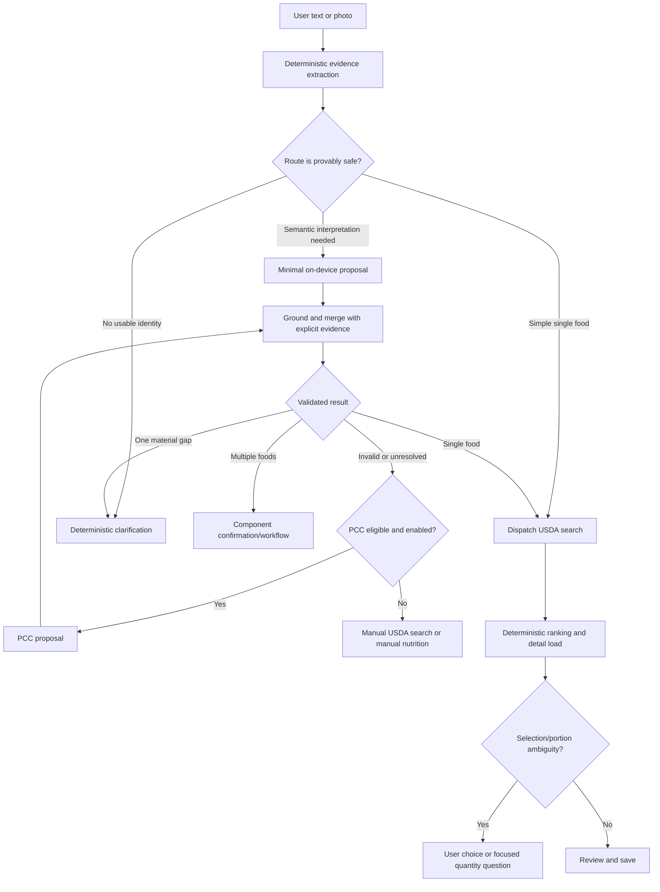
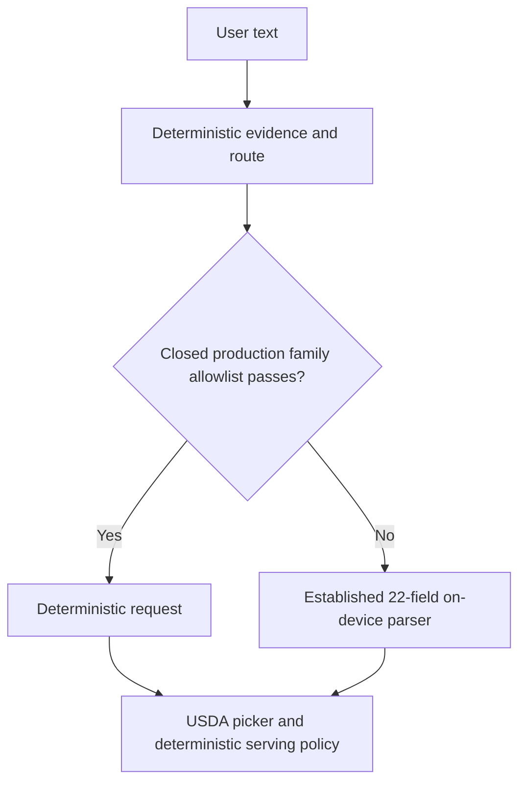

# Hybrid food interpretation implementation plan

Last updated: 2026-07-17

## Objective

Make ordinary food logging fast and deterministic while using Apple Foundation Models for the semantic cases where a language model materially improves the experience.

The intended product behavior is:

> Deterministic code extracts and protects explicit facts. The on-device model proposes meaning when syntax is insufficient. USDA supplies nutrition candidates. The user resolves material uncertainty.

This is not a plan to remove the model. It is a plan to give it a smaller, higher-value job and to stop making every log pay model latency.

## Non-negotiable invariants

1. Explicit text evidence wins over model output. A model cannot replace `2 eggs` with `1 serving`, change `large` to `small`, or introduce an unstated brand, preparation, ingredient, or package size.
2. Nutrition, unit conversion, serving resolution, aggregation, persistence, and HealthKit writes remain deterministic Swift.
3. The app never treats model self-reported confidence as evidence. Route confidence comes from observable conditions such as grounded spans, unresolved syntax, competing components, USDA rank gaps, and incompatible portions.
4. A deterministic fast path may search USDA, but it may not silently choose materially ambiguous nutrition.
5. Model output remains a proposal and passes through the existing grounder, validator, clarification policy, USDA picker policy, and serving resolver.
6. The application never runs a second model merely to hide or retry a failed first answer. Escalation must have a specific reason code.
7. Shadow comparison runs only in tests and local evaluation tools. Production must not perform unused duplicate inference that costs latency, energy, or privacy.
8. PCC, if adopted, is an explicit escalation path. Using it changes the truthful privacy claim from “food interpretation stays on this device” to “JustLogIt does not collect or retain your food data; enhanced interpretation may use Apple Private Cloud Compute.”
9. No raw food text, queries, images, FDC IDs, entry IDs, or Health data enter diagnostics.

## Target architecture



### Current shipping slice

The diagram above remains the target full-hybrid architecture. The current production path is a
deliberately narrower bridge:



The six-field semantic proposer and full `HybridFoodInterpreter` are available in Debug and the
evaluation harness, but are not the production fallback. This keeps the common safe path fast while
retaining the proven baseline for excluded syntax until physical-device comparison justifies a
semantic-path promotion.

## Release decision contract

The hybrid work is not a single all-or-nothing launch. Treat each deterministic family and each
semantic provider as an independently promotable capability. A capability moves forward only when
all of its gates pass on the same release candidate; aggregate averages cannot conceal a bad case.

| Decision | Required evidence | If the evidence fails |
| --- | --- | --- |
| Add a deterministic family | 100% explicit-fact preservation, 100% expected-route accuracy, no unsafe corpus disagreement, app/UI coverage, and a material device-latency win | Keep the family on the established fallback and add the disagreement to the corpus |
| Replace the 22-field fallback with the six-field proposer | Zero unsupported material facts, no baseline-winning safety regression, deterministic recovery for every failure mode, and better warm-device latency/energy on semantic-only cases | Keep the 22-field fallback in production; continue evaluating the six-field path in Debug |
| Replenish a prewarmed session | Repeated-log latency improves without unacceptable memory, energy, or thermal cost | Retain first-render prewarm only |
| Add PCC | Named difficult families improve materially, disclosure is truthful, and offline/quota/cancellation paths are complete | Keep interpretation fully local and expose manual recovery |

Hard rules for every promotion:

- Evidence must come from the target physical iPhone and final iOS 27 SDK/runtime, not Simulator
  timings.
- A route mismatch, unsupported material fact, altered explicit amount, or silent ambiguous USDA
  selection is an automatic failure even if aggregate accuracy improves.
- The candidate must have a content-free production metric that distinguishes its route and terminal
  outcome before it can ship.
- Rollback must be possible by selecting the prior parser architecture without changing persisted
  entries or the USDA/HealthKit contracts.
- Release builds ignore debug launch overrides; evaluation configuration never becomes a hidden
  customer-facing feature flag.

### Promotion packet

Every proposed promotion should leave a small, reviewable evidence packet:

1. Commit and build identifiers, iPhone model, iOS build, power/thermal state, and corpus version.
2. Cold and prewarmed reports for baseline, deterministic-first, and full-hybrid candidates.
3. Per-case route, explicit-fact preservation, grounding rejection, clarification, USDA selection,
   and terminal-outcome comparisons.
4. p50/p95 response and end-to-end actionable-state latency, token counts, memory, energy, and
   thermal observations, with network time reported separately.
5. The exact allowlist or provider change, its rollback selection, and regression tests added for
   every meaningful disagreement.

Without this packet, the implementation may improve in Debug but does not change the production
default.

## Responsibility split

| Concern | Deterministic | On-device model | PCC candidate | User |
| --- | --- | --- | --- | --- |
| Written numbers, fractions, units | Authoritative | Never overrides | Never overrides | Can correct |
| Container amount and alternate quantity | Authoritative | Not requested; never overrides | Not requested; never overrides | Can correct |
| Time and meal wording | Authoritative | Not requested | Not requested | Can correct |
| Common preparation and size words | Extract first | Resolves unusual wording | Resolves difficult wording | Can correct |
| Open-world food identity | Accept simple noun phrase | Primary semantic role | Escalation | Confirms through picker |
| Brand/product relationship | Validate explicit text | Proposal | Escalation | Confirms through picker |
| Multiple-food decomposition | Detect obvious grammar | Primary semantic role | Escalation for difficult cases | Confirms components |
| Clarification decision | Authoritative policy | Supplies facts, not UI prose | Supplies facts, not UI prose | Answers |
| USDA query construction | Authoritative | No generated query | No generated query | Can edit/search manually |
| USDA ranking/selection | Authoritative and conservative | No silent selection authority | No silent selection authority | Chooses when ambiguous |
| Serving and nutrition math | Authoritative | Forbidden | Forbidden | Reviews |

## Routing taxonomy

Every interpretation attempt must produce one typed route and one typed reason. Avoid stringly typed routing and arbitrary confidence scores.

```swift
enum InterpretationRoute: Equatable, Sendable {
  case deterministicSearch(ParsedFoodRequest)
  case onDeviceSemantic(SemanticInterpretationInput)
  case clarification(ClarificationQuestion)
  case composite(CompositeDraft)
  case manualSearch(String)
  case pccCandidate(PCCEscalationReason)
}

enum SemanticRouteReason: Equatable, Sendable {
  case possibleMultipleFoods
  case unresolvedFoodBoundary
  case conversationalReference
  case unfamiliarConstruction
  case photoObservation
}

enum PCCEscalationReason: Equatable, Sendable {
  case invalidOnDeviceProposal
  case unresolvedMultipleFoods
  case unresolvedConversationalReference
  case complexPhotoObservation
}
```

The production router must never use generic reasons such as `.lowConfidence` without defining what evidence was missing or contradictory.

## Safe deterministic fast path

A text request may bypass the LLM only when all applicable checks pass:

- The deterministic extractor found no contradictory number/unit relationships.
- The remainder contains one nonempty plausible food phrase.
- There is no unresolved pronoun or contextual reference such as `that`, `the other one`, or `what I had earlier`.
- There is no likely multi-food connector joining independent foods. A named single dish such as `chicken burrito` is not split merely because it can contain ingredients.
- Any brand, preparation, size, percentage, or product-line token remains source-grounded.
- No prompt-injection or conversational instruction remains in the USDA query.
- The request can proceed to a picker without assuming a serving.

Initial fast-path families:

- Identity only.
- Counted item.
- Explicit mass.
- Explicit volume.
- Fraction of a whole.
- Fraction of a sized container.

Production promotion is a closed, reviewable allowlist implemented by
`DeterministicFoodPromotionPolicy.initialProduction`. Classification alone cannot silently promote
a new family. Count-like unknown nouns are additionally restricted to the initial noun allowlist
(`apple`, `banana`, `cookie`, and `egg`) so text such as `2 scoops protein powder` cannot be
misbound as a safe count. All promoted requests must still pass the route safety checks: no
approximation, unresolved quantity, connector, reference, prompt-injection language, alternate
quantity, or conflicting fraction/container structure.

Grounded approximation is the next deterministic-family promotion candidate. In the experimental
full-hybrid interpreter, a recognized request such as `about two eggs` or `nearly two tablespoons
olive oil` currently uses the bounded semantic identity proposal, while the deterministic estimate,
unit, and approximation marker remain authoritative. The model adds no material value to this
shape; however, moving it to deterministic search must be an explicit allowlist promotion backed by
the corpus and physical-device evidence, not a hidden exception to the production gate.

Rejected deterministic shapes now have typed outcomes. An unknown number/unit binding such as
`2 scoops protein powder` stops at editable manual recovery without invoking the model, because a
semantic identity proposal cannot repair the amount that the merger treats as authoritative. A
recognized family disabled by an injected promotion policy also stops absolutely. Unapproved
article identities such as `a chicken breast` preserve the grounded identity but ask a deterministic
quantity question; they never infer that the article means one serving.

Initial model-required families:

- Likely independent foods: `cereal with milk`, `eggs and toast`, `coffee with cream`.
- Conversational references: `the other half of that burrito bowl`.
- Unclear food boundaries: `a turkey club with fries`.
- Vague nonidentity: `something good`, `the usual`, `leftovers`.
- Photo input.

The family lists are hypotheses. The corpus, not intuition, determines promotion.

## Deterministic evidence model

Add a Core-level, Foundation-Models-free representation that records what Swift can prove from the source text.

```swift
struct FoodTextEvidence: Equatable, Sendable {
  var normalizedSource: String
  var identityCandidate: String?
  var explicitBrand: String?
  var explicitPreparation: String?
  var explicitDescriptors: [String]
  var quantity: QuantityEvidence?
  var fraction: FractionEvidence?
  var container: ContainerEvidence?
  var alternateQuantity: QuantityEvidence?
  var approximationMarkers: [ApproximationMarker]
  var possibleMultipleFoodConnectors: [ConnectorEvidence]
  var unresolvedReferences: [ReferenceEvidence]
  var strippedLoggingLanguage: [SourceRange]
}
```

Implementation requirements:

- Reuse `ParsedQuantityRecovery`, `LocalizedNumberParser`, unit normalization, fraction/container logic, and existing grounding helpers. Do not create a competing number parser.
- Preserve source ranges or equivalent provenance for facts that could materially change nutrition.
- Keep the evidence object ephemeral. Do not persist the original message in a new analytics or diagnostics store.
- Make extraction deterministic across locale and capitalization. Add explicit locale fixtures rather than relying on the developer machine.

## Minimal semantic proposal

Replace the current 22-field generated object for the hybrid path with a narrow facts-only proposal:

```swift
@Generable(representNilExplicitlyInGeneratedContent: true)
struct SemanticFoodProposal {
  var productName: String
  var brand: String?
  var preparation: String?
  var descriptors: [String]
  var containsMultipleFoods: Bool
  var componentNames: [String]
}
```

Do not ask this model to generate:

- `searchTerms`
- quantity, unit, fraction, container, or alternate quantity already extracted by Swift
- `quantityNeedsClarification` or `preparationNeedsClarification`
- `ambiguityNotes`
- user-facing clarification prose
- clarification suggestions
- nutrition, serving size, or a USDA record

Merge policy:

1. Ground the proposal against source text or the bounded photo observation.
2. Reject unsupported product, brand, preparation, descriptor, and component facts.
3. Overlay authoritative deterministic quantity/container/time evidence.
4. Rebuild search terms in Swift.
5. Run `FoodInterpretationValidator` and `ClarificationPolicy`.
6. Ask one deterministic question or continue to USDA.

## Clarification policy

Clarification remains a deterministic product decision, in this order:

1. No usable food identity: ask for the food name.
2. Multiple foods without confirmed components: ask which foods were present or present component confirmation.
3. Quantity/size required by the selected USDA details: ask for the narrow missing fact.
4. Preparation materially changes the search and is absent: ask how it was prepared.
5. Otherwise continue to the USDA picker/review.

Do not ask for quantity merely because the initial text omitted it. Search can happen first; selected USDA portions determine whether a safe generic serving exists.

## Session and prewarming policy

- Keep the current first-Log-render prewarm; do not block `App.init` or the first frame.
- Preserve the prompt-prefix prewarm.
- Never reuse a transcript-bearing session for a different log.
- Evaluate replenishing at most one unused prewarmed session after a request finishes or the composer becomes idle.
- Replenishment is eligible only if physical-device measurements show a material repeated-log or clarification improvement without unacceptable energy, memory, or thermal cost.
- A deterministic fast-path request must not wait for prewarm and must not trigger an unused model request.

## PCC policy

PCC is not part of the first production slice. Requesting entitlement access may happen in parallel.

Before PCC can ship:

- Add `LanguageModel` injection so the same minimal proposal can run through on-device and PCC models.
- Add PCC to the evaluation harness as a distinct provider/profile; never pool its results with on-device results.
- Define explicit eligibility, availability, daily-limit, offline, cancellation, and fallback behavior.
- Add a user-facing Enhanced Interpretation setting or equally clear just-in-time disclosure.
- Update privacy copy and App Store privacy answers before enabling it.
- Prove a material quality improvement on named difficult case families. “The model is larger” is not an acceptance criterion.

## Evaluation and observability

Extend every corpus case with an expected route family:

- deterministic search
- on-device semantic
- clarification
- composite
- manual
- PCC candidate

Measure separately:

- deterministic extraction duration
- route-decision duration
- observable prewarm and session-acquisition duration (never mislabeled as model loading)
- input/cached/output/reasoning tokens
- response-generation duration
- grounding/merge duration
- time to USDA request dispatch
- USDA cache/network/decode/ranking duration
- total time to first actionable UI

Diagnostics record only typed route/reason categories, bounded counts, and durations. Evaluation attachments remain redacted by default.

Foundation Models does not expose model-loading duration or time to first token in the APIs used by
the app. Those remain intentionally unclaimed. The app records distinct prewarm,
session-acquisition, and complete-response intervals instead. `first_actionable_ui` ends when the
main-actor view model publishes its first usable clarification, picker, review, or recovery state;
it is not a rendered-frame timestamp.

Provisional physical-iPhone targets, to be revised after a clean baseline:

| Path | Target |
| --- | --- |
| Deterministic extraction p95 | ≤ 25 ms |
| Deterministic route to USDA dispatch p95 | ≤ 100 ms |
| Cached USDA results visible p95 | ≤ 300 ms after dispatch |
| Warm minimal on-device interpretation p50 | ≤ 3 seconds |
| Warm minimal on-device interpretation p95 | ≤ 6 seconds |
| Cold minimal on-device interpretation p95 | ≤ 8 seconds |
| Unsupported invented facts | 0 |
| Explicit quantity/size/preparation preservation | 100% |
| Source grounding | 100% |

Network time and PCC time are reported independently rather than hidden inside model latency.

## Ordered implementation phases

### Phase 0 — Re-establish a trustworthy baseline

Status: In progress — software gates green on 2026-07-16; physical-device latency and
Instruments measurements remain.

Baseline recorded on 2026-07-16:

- `JustLogItCore`: 136 tests passed before the hybrid slice.
- `LoggingEval`: 8 tests passed.
- Backend: 18 tests and TypeScript compilation passed.
- App unit suite on a clean iOS 27 iPhone 17 Pro simulator: 123 passed, one intentionally
  device-only test skipped, zero failures.
- Result bundle: `/tmp/JustLogIt-hybrid-baseline/Logs/Test/Test-JustLogIt-2026.07.16_17-49-17--0400.xcresult`.

Remaining tasks:

- Run the current parser corpus on a physical iOS 27 device with fresh-session and prewarmed
  profiles using the foreground, counterbalanced, resumable protocol in
  [`REAL_IPHONE_ACCEPTANCE_RUNBOOK.md`](REAL_IPHONE_ACCEPTANCE_RUNBOOK.md). The interrupted
  2026-07-16 background-stress run is not acceptance evidence.
- Capture a Foundation Models Instruments trace for representative simple, compound, clarification, and repeated-log cases.
- Record current input/cached/output/reasoning tokens plus observable prewarm, session-acquisition,
  response, extraction, routing, grounding/merge, USDA-dispatch, and actionable-state durations.
  Do not claim model-loading or TTFT metrics that Foundation Models does not expose.
- Update `Documentation/ParserEvaluation.md` and `Documentation/Performance.md` with the actual device/build.

Automation now available:

- The canonical software gate is green at the counts recorded in Phase 4.
- `Scripts/run-on-device-parser-eval.sh` validates Xcode-beta, the iOS 27 SDK, corpus version,
  compatible physical-device destination, privacy-safe environment, result bundle, and redacted
  JSON attachment. It runs baseline, deterministic-first, and full-hybrid candidates across cold
  and prewarmed states, and treats a Foundation Models availability skip as a failed preflight.
- Physical-device discovery uses structured CoreDevice JSON and maps either the CoreDevice UUID or
  hardware UDID to the hardware UDID expected by `xcodebuild`. Its fixture suite is part of the
  canonical CI gate, and `--dry-run` performs no build, install, launch, or test operation.
- The script is validated locally against corpus `1.3.0`; it has not been represented as a device
  result. Instruments energy/memory/thermal profiling remains a separate follow-up so its overhead
  does not contaminate the correctness/latency corpus.

Exit gate:

- Current behavior and latency are reproducible; no new architecture is blamed for pre-existing failures.

### Phase 1 — Add route contracts and deterministic evidence extraction

Status: Complete on 2026-07-16. The resulting evidence and routing contracts now support the
shipping deterministic-first wrapper.

Implemented on 2026-07-16:

- Added ephemeral deterministic evidence types, typed routes/reasons, a conservative routing
  policy, and a Foundation-Models-free evidence extractor in `JustLogItCore`.
- Added route/evidence coverage for the first-slice cases plus vague quantities, leading
  approximations, relative time, numeric product identities, and corpus-style prompt injection.
- Expanded fast Core safety coverage for non-food/control text, invalid amounts, named dishes,
  context contamination, partial hallucinations, and composite quantity binding.
- Fixed two corpus-exposed safety defects: composite component quantities can no longer become a
  whole-meal amount, and nonpositive or implausibly large counts cannot route to USDA.
- Added normalized-source UTF-16 provenance for every material deterministic fact, locale-stable
  POSIX folding, decimal preservation, conservative explicit paired-quantity extraction, and
  syntax-declared brand evidence. Unlabeled proper nouns and maker relationships remain model-owned.
- Fixed the extraction-order regression where a syntax-declared trailing brand could prevent a
  leading amount from being recovered; the regression now proves identity, amount, brand, and all
  source spans together.
- The original Core slice reached 176 Swift Testing cases with zero failures. The current canonical
  gate includes 192 Swift Testing cases plus ten XCTest cases for 202 Core tests total.

Completed tasks:

- Add `FoodTextEvidence`, provenance types, `InterpretationRoute`, and typed route reasons to `JustLogItCore`.
- Implement `FoodTextEvidenceExtractor` by composing existing deterministic utilities.
- Add table-driven tests for simple identities, written numbers, fractions, containers, percentages, numeric product identities, preparation, filler text, connectors, pronouns, prompt injection, and malformed quantities.
- Extend the evaluation corpus with expected route families.
- Kept extraction isolated until its Core gate passed, then integrated it through the production
  deterministic-first wrapper in Phase 4.

Exit gate (met):

- Full Core suite passes.
- Explicit facts are preserved with 100% accuracy on the expanded deterministic corpus.
- The Core-only slice introduced no production behavior change; production integration happened
  later through the reviewed Phase 4 allowlist.

### Phase 2 — Introduce the minimal semantic model behind a protocol

Status: Implemented in isolation on 2026-07-16; physical-device candidate evaluation remains.

Implemented:

- Added the six-field `SemanticFoodProposal`, a two-input context/grounding contract, typed semantic
  failures, strict proposal grounding/rejection, and an authoritative evidence merger.
- Added `HybridFoodInterpreter`, which invokes the semantic proposer zero times on deterministic or
  clarification routes and exactly once on semantic routes. Cancellation is checked after inference
  so a late non-cooperative result cannot publish.
- Added separate iOS and Mac iOS-27 Foundation Models proposers with a 192-token ceiling and parity
  tests for schema, prompt, prefix, generation options, and reasoning policy.
- Core suite: 176 tests passed. LoggingEval suite: 13 tests passed. Simulator app build succeeded.
- The existing 22-field parser remains independently selectable and is the fallback used by the
  production deterministic-first wrapper. The six-field full-hybrid parser remains a separate
  candidate pending physical-device promotion evidence.

Tasks:

- Define a `SemanticFoodProposing` protocol independent of a concrete Apple model.
- Implement the six-field on-device `SemanticFoodProposal`.
- Add deterministic proposal grounding and evidence merge.
- Keep the current 22-field parser available as the baseline profile.
- Maintain exact app/Mac evaluator schema and prompt parity.
- Add fake-proposer tests for valid, hallucinated, stale, multiple-food, empty, refused, unavailable, and cancelled results.

Exit gate:

- The minimal proposal meets existing grounding and hallucination gates.
- It cannot mutate explicit quantity/container evidence.
- Baseline and candidate can be selected independently in the harness.

### Phase 3 — Add a hybrid coordinator in evaluation/shadow mode

Status: Implemented for candidate selection/reporting on 2026-07-16; running the full physical-device
comparison corpus remains.

Implemented:

- Added `--parser-candidate baseline|deterministic-first|hybrid` as an independent evaluator
  dimension.
- Each evaluation case runs exactly one selected interpretation candidate.
- Hybrid reports label route, typed reasons, and whether a semantic model was invoked; parsed JSON
  overrides are labeled separately.
- Safe clarification/composite/manual routes stop before USDA instead of issuing an empty query.
- Added selection tests proving deterministic routes invoke no model and semantic routes invoke the
  proposer once without dispatching USDA for a composite handoff.
- Extended the on-device XCTest harness with
  `PARSER_EVAL_CANDIDATES=baseline22Field,deterministicFirst,hybrid`.
  Candidate is now part of every observation and summary grouping; baseline prompt eligibility no
  longer force-unwraps profiles that do not exist for the hybrid schema.
- Added a separate hybrid eligibility comparison and kept baseline-only execution as the default.
- Hybrid prewarmed evaluation now actually prewarms the semantic session and reports semantic
  response/prewarm latency plus input, cached-input, output, reasoning, and total token counts.
- The physical-device harness now includes prior user context for context-change cases while keeping
  the current user text as the only grounding source.
- Promotion now fails on any per-case safety regression that aggregate rates could otherwise hide.
- The deterministic-first evaluator uses the exact Core production wrapper. Its report records
  fast-path use, promoted family, parse source, and fallback warm/prewarm/token metrics. Tests prove
  a promoted apple invokes the model zero times and an excluded `eggs and toast` request invokes the
  22-field fallback exactly once.
- The consolidated host report now pairs both `deterministicFirst` and `hybrid` with the production
  22-field profile for the same model use case, warm state, case ID, and run. Every observable
  disagreement is classified as `candidate_improvement`, `production_improvement`,
  `both_acceptable`, or `unsafe` from a closed contract: parse/error outcome, source grounding,
  required-field correctness, invented-fact detection, behavior correctness, typed route
  correctness, and the USDA terminal class (`directSearch`, `compositeHandoff`, `blocked`, or
  `blockedByParserError`). Missing pairs are incomplete evidence, not agreement.
- Privacy invariant 9 deliberately prevents the consolidated report from comparing raw parsed
  requests, USDA query strings, clarification prose, or reversible content fingerprints. Therefore
  `both_acceptable` means only “both satisfy the recorded closed dimensions”; it does **not** assert
  semantic or nutrition-path identity. Every meaningful disagreement carries
  `contentEquivalenceEvaluated: false` and `privateHumanReviewRequired: true`. Exact identity,
  quantity, brand, query, clarification, and downstream nutrition differences must be reviewed
  in an attended local rerun through the visible app flow or an ephemeral debugger/test inspector
  that does not persist content. The redacted `.xcresult` alone cannot prove those differences.
  Record the conclusion only as a closed corpus expectation or regression case—not as copied text,
  a query, or a content fingerprint in diagnostics.

Tasks:

- Add `HybridFoodInterpreter` that runs evidence extraction, routing, semantic proposal when required, merge, validation, and clarification policy.
- Run baseline and hybrid outcomes side-by-side only in tests/LoggingEval.
- Report closed route/correctness/USDA-terminal disagreements, token counts, and latency. Inspect
  exact parsed-request, query, or clarification differences only during private human review; never
  place their text or a reversible fingerprint in the consolidated artifact.
- Add regression cases for every disagreement that reaches a materially different nutrition path.

Exit gate:

- No production duplicate inference.
- Every observable deterministic-first/hybrid disagreement against production is classified as
  candidate improvement, production improvement, both acceptable under the closed dimensions, or
  unsafe. Content-level equivalence remains explicitly unclaimed until private human review.
- Unsafe hybrid disagreements are zero for any family considered for promotion.

### Phase 4 — Promote proven deterministic fast-path families

Status: Implemented in production and green through the canonical software gates on 2026-07-16.
Physical-device latency and corpus acceptance remain required before expanding the allowlist or
promoting the full-hybrid semantic path.

Implemented:

- Added a contextual parsing requirement that always keeps bounded assistant context separate from
  user-authored grounding evidence. Legacy parsers receive a compatible default implementation.
- The shipping 22-field fallback now overrides that contextual path: the model sees bounded
  clarification context, while generated facts are grounded only against current user-authored
  evidence. Assistant questions can no longer authorize nutrition-changing facts.
- Added `FoodParserFactory` with three explicit architectures: `baseline22Field`,
  `deterministicFastPath`, and `fullHybrid`. Production and Release default to
  `deterministicFastPath`: proven requests skip inference, while every excluded request falls back
  exactly once to the established 22-field parser.
- Added mutually exclusive Debug launch overrides: `-baseline-parser`, `-deterministic-parser`, and
  `-hybrid-parser`. Release ignores parser overrides. Conflicting Debug overrides are rejected.
- The deterministic-first wrapper forwards speculative prewarm to its 22-field fallback, but a
  promoted request does not wait for or invoke the model.
- Added a LogViewModel integration test proving assistant wording never becomes grounding evidence.
- Added explicit single/multiple semantic assessment metadata so a model-confirmed named dish such
  as `mac and cheese` is not re-split by legacy conjunction inference.
- Added content-free hybrid route/outcome observability that distinguishes manual search, PCC
  candidacy, semantic unavailability, refusal, invalid output, and session acquisition latency.
- Added privacy-safe parser-architecture, deterministic-family/fallback, semantic-invocation, and
  semantic-session-source observations. Diagnostics remain typed and content-free.
- Added a generic one-shot prepared-resource pool. Simulator tests prove exactly-once consumption,
  fresh-session fallback, one production under 20-way concurrent prewarm, and cancellation safety
  before and after preparation. Semantic inference records whether its session was prewarmed or
  fresh.
- Added deterministic conversion of the hybrid `.manualSearch` terminal route into an app-facing
  recovery error, preventing an empty request from being misclassified as a composite.
- Full hybrid applies the same closed promotion policy as production. Non-promoted shapes use a
  typed rejected-shape policy: grounded approximations take the bounded semantic identity path,
  unsafe amount bindings and disabled families stop at editable manual recovery, and unsupported
  articles ask a grounded quantity question. Leading `a`/`an` becomes count one only for the
  approved apple/banana/cookie/egg nouns.
- Added Simulator UI scenarios for the shipping deterministic-first egg path and the full-hybrid
  deterministic, named-dish, composite, grounded-approximation, unsafe-amount, unavailable,
  refused, and invalid-output paths. These nine architecture-specific scenarios pass and cover
  picker/auto-review progress plus recoverable model outcomes without internal route language.
- Canonical CI on an iOS 27 iPhone 17 Pro Simulator is green: Core 205 tests total (ten XCTest and
  195 Swift Testing cases), app 181 tests with one intentional physical-device-only skip,
  LoggingEval 20 tests, and Backend 18 tests, all with zero failures. The repository secret scan is
  clean.
- The complete rebuilt 19-case UI suite passed with zero failures on the iOS 27 iPhone 17 Pro
  Simulator. The two previously failing interactions were test-contract defects, not weakened app
  behavior: the time test now asserts the combined chat-bubble accessibility label, and the unsized
  egg test selects a USDA result before expecting detail-level portion ambiguity.
- A clean unsigned generic-device Release build and archive pass both release validation phases.
  UI-test arguments and doubles are compiled out of Release, the embedded privacy manifest includes
  the cache file-timestamp reason `C617.1`, and the stripped product contains no mock/UI-test marker
  or Debug USDA-key field.

Tasks:

- Keep the complete 19-case UI suite green as routing and interaction behavior evolve.
- Run the baseline, deterministic-first, and full-hybrid corpus candidates on the target physical
  iPhone; record cold and warm latency, token, energy, memory, and thermal behavior.
- Promote no additional deterministic family and do not make full hybrid the production semantic
  fallback until its physical-device safety and latency gates pass.

Exit gate:

- Fast-path families pass deterministic, app-unit, complete UI, and physical-device acceptance
  tests.
- No regression in quantity/portion safety.
- Time to USDA dispatch materially improves versus baseline.

### Phase 5 — Optimize the remaining on-device semantic path

Status: Host-side comparison support complete; physical-device measurement and candidate selection
remain pending.

Implemented:

- `.general` and `.contentTagging` are separate, checksum-validated runner blocks and consolidated
  report dimensions.
- Capability-aware light reasoning and disabled reasoning are separate evaluation dimensions for
  both the baseline and minimal semantic model. The iOS Release app exposes only the shipping
  capability-aware policy; disabled reasoning remains available in Debug and the standalone Mac
  evaluator.
- iOS evaluation attachments now include direct Foundation Models usage plus observable prewarm,
  session acquisition, complete response, mapping, deterministic extraction, routing, and
  grounding/merge timings. No field is labeled model load or time to first token.
- The redacted promotion report keeps model-use-case and reasoning-policy groups separate and
  cannot promote a focused or non-shipping-policy matrix.

Tasks:

- Compare `.general` and `.contentTagging` on only the semantic-required corpus.
- Compare reasoning disabled versus capability-aware light reasoning.
- Compare cold, first prewarmed, and replenished-prewarm behavior.
- Use Instruments to determine whether schema input, model loading, or output generation dominates.
- Evaluate schema exclusion/caching APIs only where their correctness preconditions are satisfied.

Exit gate:

- Adopt a candidate only if it meets absolute quality gates and improves physical-device latency without worsening stability, energy, or cancellation.

### Phase 6 — Evaluate PCC escalation

Status: Pending

Tasks:

- Add PCC as a provider to the same semantic protocol and harness.
- Run only the named difficult/PCC-candidate families.
- Test entitlement absence, offline behavior, daily limits, cancellation, app backgrounding, privacy disclosure, and deterministic fallback.
- Decide whether PCC is off, opt-in, or automatic-with-disclosure based on evidence and product privacy positioning.

Exit gate:

- PCC materially improves difficult-case correctness.
- Simple logs never route to PCC.
- Offline and quota failures preserve a complete local/manual path.

### Phase 7 — Release and UAT

Status: Pending

Tasks:

- Run the complete parser corpus on the target physical iPhone and final iOS 27 build.
- Run full app unit, integration, UI, Backend, secret, Release, and archive gates.
- Perform interactive UAT for fast, semantic, clarification, composite, photo, offline, cancellation, repeated-log, and manual paths.
- Verify VoiceOver and Dynamic Type announcements during each latency class.
- Review every user-facing string for internal/model/debug language.
- Update privacy/support documentation and App Store answers.

Exit gate:

- Every expected interaction is possible without a dead end.
- The app tells the truth about on-device versus PCC processing.
- Known bugs are logged with reproduction steps and severity.

### Phase 8 — Begin Siri AI integration after hybrid acceptance

Status: Deferred. This phase starts only after the hybrid architecture passes its physical-iPhone
corpus, performance, Instruments, Release, and interactive-UAT gates. It is a successor project, not
an excuse to broaden or postpone hybrid acceptance.

Authoritative handoff and backlog:

- `Documentation/SIRI_AI_INTEGRATION_SPIKE.md`
- `Backlog/SiriAIIntegration.md`

Ordered work:

1. Revalidate the release-candidate iOS 27 App Intents, App Shortcuts, App Schemas, testing, phrase,
   foreground-mode, and execution-target APIs against the installed SDK.
2. Implement Spike A: a typed pending-log request plus `StartFoodLogIntent` that opens the existing
   reviewed Log flow with Siri-authored text and optional consumed time preserved.
3. After Spike A passes physical-device Siri/Shortcuts and cold-launch tests, extract the shared
   headless workflow and transactional repository described by Spike B.
4. Implement confirmed in-Siri saving only after the shared workflow proves that ambiguous,
   composite, unavailable, and choice-requiring cases foreground safely with no partial or duplicate
   record.
5. Defer entry entities, Spotlight exposure, and summaries until their separate privacy review.

Hard boundary:

- Siri is an input and presentation adapter. It never supplies authoritative nutrition, silently
  selects an ambiguous USDA food, bypasses review/confirmation, creates a second parser or serving
  pipeline, triggers HealthKit authorization, or writes before explicit confirmation.

Spike A exit gate:

- A physical-device “Log food in JustLogIt” request followed by the answer “two scrambled eggs”
  reaches the normal Log workflow with its full food text and optional time intact; cancellation creates no local or HealthKit
  record; cold launch does not regress the asynchronous SwiftData bootstrap; and ordinary in-app
  logging remains unchanged.

## Original first implementation slice — complete

The first code change after this plan was deliberately boring and reversible:

1. Restore/confirm a green baseline.
2. Add Core-only route/evidence types.
3. Implement deterministic extraction by reusing existing utilities.
4. Add route expectations to at least these cases: apple, two large scrambled eggs, one cup rice, half a 12-ounce Coke, Oreo, 7 Layer Dip, cereal with milk, eggs and toast, turkey club with fries, leftovers, something yummy, conversational reference, prompt injection, and malformed quantity.
5. Run Core and evaluator tests.
6. Do not change production routing until the evidence is inspectable.

This slice provided useful architecture and tests without risking the shipping flow or prematurely
deciding which prompts deserved the fast path. Production integration occurred only afterward via
the closed Phase 4 promotion policy.

## Likely file map

New or Core-focused:

- `Packages/JustLogItCore/Sources/JustLogItCore/FoodTextEvidence.swift`
- `Packages/JustLogItCore/Sources/JustLogItCore/FoodTextEvidenceExtractor.swift`
- `Packages/JustLogItCore/Sources/JustLogItCore/InterpretationRoute.swift`
- `Packages/JustLogItCore/Tests/JustLogItCoreTests/FoodTextEvidenceExtractorTests.swift`

Later app integration:

- `JustLogIt/Services/HybridFoodInterpreter.swift`
- `JustLogIt/Services/FoundationModelsFoodParser.swift`
- `JustLogIt/Features/Log/LogViewModel+Internals.swift`
- `JustLogItTests/ParserEvaluationCorpus.swift`
- `JustLogItTests/ParserEvaluationHarnessTests.swift`
- `Tools/LoggingEval/Sources/LoggingEval/MacFoundationModelsFoodParser.swift`
- `Tools/LoggingEval/Sources/LoggingEval/EvalRunner.swift`

Documentation:

- `Documentation/ParserEvaluation.md`
- `Documentation/Performance.md`
- `Documentation/Privacy.md`
- `Documentation/QUALITY_HARDENING_HANDOFF.md`

## Definition of done

The hybrid effort is complete when:

- Proven simple logs reach USDA without invoking a model.
- Semantic cases still benefit from Apple Foundation Models.
- Explicit evidence is never weakened by model output.
- Clarification and nutrition decisions remain deterministic and testable.
- Physical-device measurements show a meaningful common-path latency improvement.
- PCC, if present, is an evidence-backed escalation with truthful disclosure.
- The complete test/UAT suite is green and no route produces a dead end.
